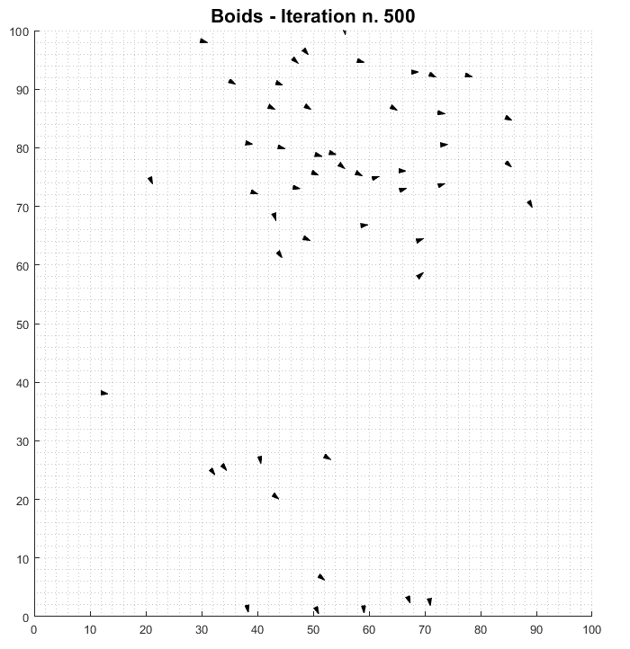
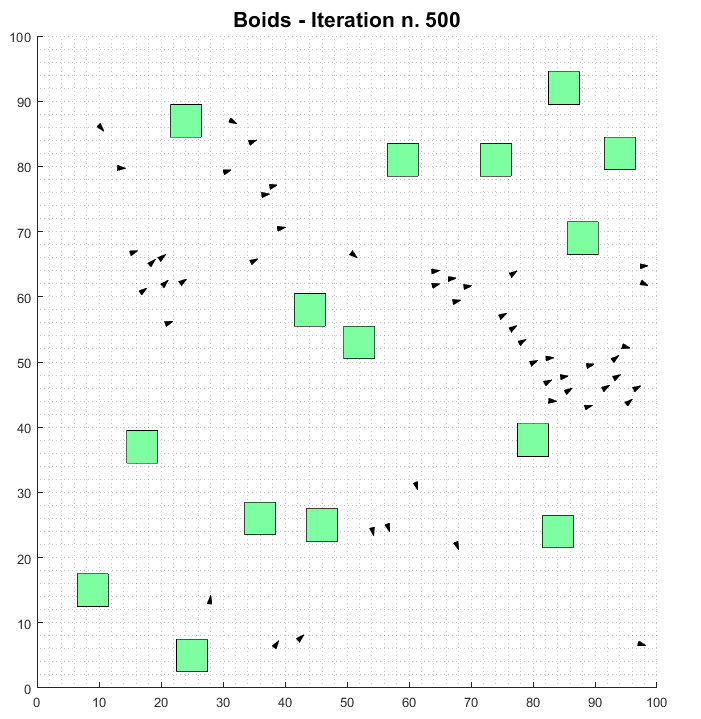

# Boids

Project developed by Marcelo Sousa Gomes and Rafael Duarte de Sousa in June 2021 as a homework for the course of Computational Intelligence, part of the  electrical engineering academic master's program.

## Description

This project is based on the algorithm described by Craig W. Reynolds in *Flocks, Herds, and Schools: A Distributed Behavioral Model* (1987) [[1]](#1). Each Boid is a particle that has a position, a direction of movement and a velocity that is updated in every iteration of the simulation based on separation, cohesion and alignment forces.

Considering the separation radius as *Rs*, the alignment radius as *Ra* and the cohesion radius as *Rc* and *Rs*<*Ra*<*Rc*:

* The separation force is the sum of the forces applied to a boid to avoid colision with boids that are in a distance (euclidian) that is less than the separation radius. 
* The alignment force is the force that is applied to the boid so its direction will be the average direction of the boids that are in a distance between *Rs* and *Ra* (*Rs*<distance*Ra*).
* The cohesion force is the force that is applied to the boid so it will move to the centroid defined by the boids in the radius *Rc*.

This model also has adaptations proposed by Couzin *et al* in *Collective Memory and Spatial Sorting in Animal Groups* (2002) [[2]](#2) that prioritize the separation force in a boid when its distance from another boid is less than the separation radius. In this condition, the separation force is the only force that acts on the boid.

If *Rs*<*Ra*<*Rc*, the boids tend to group as shown below:

Other input parameters are the universe limits, the number of iterations, the number of boids, the boid size, the boid velocity, the standard deviance of random direction changes that may occur on the boids, parameters to scale the separation, cohesion and alignment forces and the separation radius for each of these forces.

A number (*numObstacles*) of square-shaped obstacles with size *obstSize* with random positions can be also be added. There also a separation radius between the boids and the obstacles. The boids with obstacles can be seen in the image below:

## Known issues
* Due to the short time for the development of this project, the relationship between the input variables such as the radius for each zone (separation, alignment and cohesion) could not be fine-tuned to make the behaviour of the boids more natural.

* Colisions between boids might occur when they are near an obstacle due to the imbalance in the scaling between the separation and obstacle avoidance behaviours.

* The direction attribute in the boid constructor is receiving the parameter 'dir'. 'dir' is also the name a function in MATLAB that lists files and folders in the current folder. Unfortunately, this was noticed a year later during the writing of the README.

* In the initial state (t=0), the boids and obstacles might be overlapped, this is corrected in the first step but a way to avoid this overlap in the initialization should be defined.

## Contribute
This code can improved with the correction of the know issues listed above. Other elements could also be added, such as boids that simulate predators and parameters of the interaction between these new boids and the conventional ones. Finally, this model could be adapted to three dimensions.

## References

<a id="1">[1]</a> 
Reynolds, C. W. (1987, August). Flocks, herds and schools: A distributed behavioral model. In Proceedings of the 14th annual conference on Computer graphics and interactive techniques (pp. 25-34).

<a id="2">[2]</a> 
Couzin, I. D., Krause, J., James, R., Ruxton, G. D., & Franks, N. R. (2002). Collective memory and spatial sorting in animal groups. Journal of theoretical biology, 218(1), 1-11.
